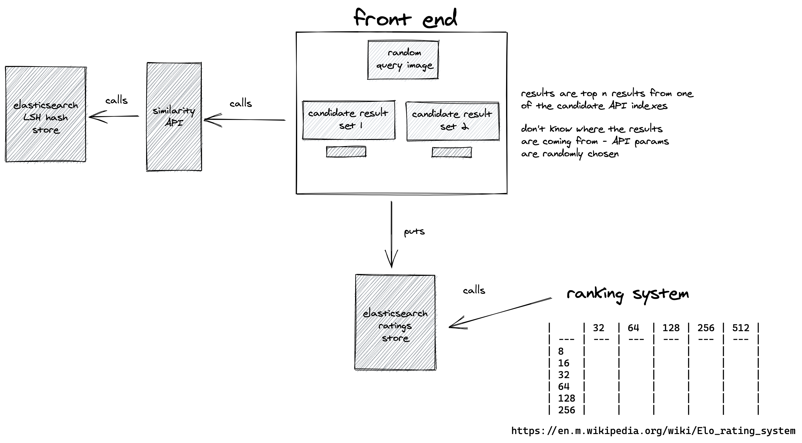

# Subjective assessment of similarity goodness

Simple app to decide which of two candidate models produces better results for a given query image.

- Randomly chooses a pair of models
- Makes a request to both for a given query image
- Stores the winning model name in an elasticsearch index

