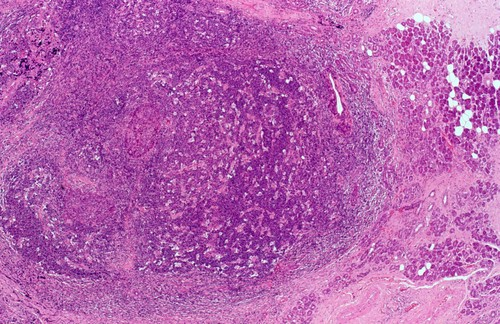

# 5 dimensional colour

We're interested in generating hashes for images based on their dominant colours, making them both searchable by colour, and quickly comparable to one another.

At their core, our existing methods for doing this have involved finding clusters of pixels in colour space for each image. We've experimented with many different clustering algorithms across multiple colour spaces (RGB, LAB, HSV).

## Hypothesis

The core idea here is to move to a 5d colour space which incorporates the spatial distribution of colour across the image before we generate clusters. That's 3 colour dimensions (L, A, and B) and 2 spatial dimensions (x and y).

Finding clusters in 5d should make strong clusters of a single colour in the image (ie those that often dominate our visual perception) more 'important' than those single colours which are scattered across the image, not contributing to visual dominance.


For example, we would expect an algorithm to highlight the bright red of the flowers as a dominant colour in the image above, not only because of the number of pixels with similar hues, but because they are spatially distinct within the image. The brown hues of the page edges might occupy a larger number of pixels, but because they're more spatially distributed we would expect them to be measured as less visually dominant.

After clustering, cluster centers for the dominant colours should be extracted _only_ in the three colour-space dimensions.

## Results

A brief set of experiments suggest that this method works well!

Using the reference image above, clustering in 3 LAB dimensions (ie using the old method) gives us the following palette:


But by adding two new spatial dimensions to our data before clustering, we get the following palette instead!


This is exactly what we would hope to see - ordered from left to right according to visual dominance, the new algorithm correctly extracts the red of the flower petals as an important colour!

For images without significantly spatially distinct colours, both methods produce almost exactly the results:

Reference image:



Old:


New:


## Running this code yourself

To get started, run

```
docker compose build
```

This will build the necessary images for running these experiments locally, and shouldn't take more than a couple of minutes.

### Fetching image URLs

You'll need to fetch some image URLs from the wellcome collection API before you start either of the other services.

```
mkdir data
docker compose run data
```

### Running exploratory notebooks

To play around in the exploratory notebooks where this idea was first implemented, run

```
docker compose up jupyter
```

### Running the pipeline

To extract palettes for all of the collected image data into an elasticsearch index for search and comparison (using all of the usual associated [LSH](https://en.m.wikipedia.org/wiki/Locality-sensitive_hashing) magic) run

```
docker compose up extract
```
